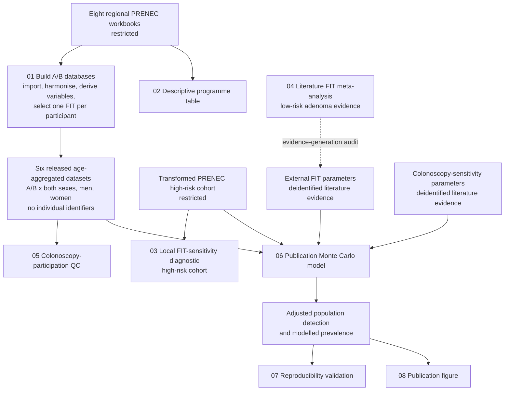

# PRENEC analysis pipeline

## Data flow

## Execution order

The open-repository default starts from the released A/B products and runs
`06 -> 07 -> 08`. In an authorised data environment,
`--rebuild-intermediate` runs `01 -> 02 -> 06 -> 07 -> 08`.
Scripts 03--05 are diagnostic or evidence-generation checks. They document
local FIT sensitivity, the low-risk FIT meta-analysis, and colonoscopy
participation, but their exported files are not read directly by script 06.
Script 06 reproduces the required local FIT-sensitivity and participation
calculations internally.

## Stage definitions

### 01: A/B database construction

- Reads the eight regional Excel workbooks from `PRENEC_DATA_DIR`.
- Harmonises types using the Santiago workbook as the template.
- Derives enrolment age, FIT rounds, lesion size, histological risk, and the
  qualifying colonoscopy window.
- For participants with two FIT results, assigns one result to A and the other
  to B using a reproducible complementary randomisation.
- Restricts the analytical aggregates to participants without reported family
  history of colorectal cancer (`highrisk == 0`).
- Produces total, men, and women datasets for A and B.

### 02: Descriptive analysis

Reads the regional workbooks independently of the A/B model and produces the
programme-level descriptive table for `highrisk == 0`.

### 06: Publication model

- Uses the six A/B aggregates as the target-population inputs.
- Uses the transformed high-risk PRENEC cohort to estimate local FIT
  sensitivity.
- Uses committed literature parameter workbooks for the external FIT and
  colonoscopy sensitivity scenarios.
- Propagates uncertainty by Monte Carlo simulation with fixed seeds.
- Produces adjusted population detection and modelled prevalence for three
  lesion categories and three sex strata.

### 07--08: Validation and reporting

The validation script checks dimensions, unique keys, interval ordering,
finite values, and optional draw-level equivalence. The figure script creates
the final multipanel figure from the exported publication estimates.

